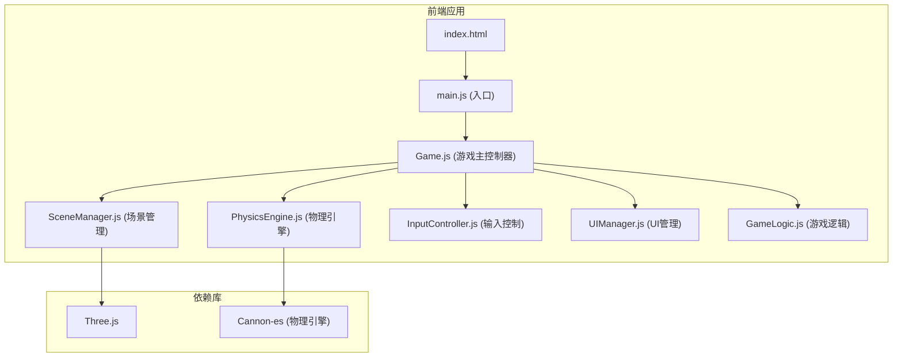

## 1. 架构设计



## 2. 技术描述

- **前端框架**：原生 JavaScript (ES6+)，使用 Vite 作为构建工具
- **3D 渲染**：Three.js (0.160.0)
- **物理引擎**：Cannon-es (0.20.0) - 替代原生物理模拟，提供更真实的物理效果
- **构建工具**：Vite 5.0
- **样式**：原生 CSS，CSS 变量管理主题色
- **代码组织**：模块化设计，按功能划分文件

## 3. 文件结构

```
src/
├── main.js              # 应用入口
├── Game.js              # 游戏主类，协调各模块
├── core/
│   ├── SceneManager.js   # 场景、相机、灯光、渲染器管理
│   ├── PhysicsEngine.js  # 物理世界、刚体、碰撞检测
│   ├── InputController.js  # 鼠标输入处理
│   └── UIManager.js   # UI 显示、角度、分数、提示
├── game/
│   ├── Platform.js     # 平板类
│   ├── Ball.js       # 球体类
│   ├── TargetHole.js   # 目标洞类
│   └── GameLogic.js  # 游戏逻辑、状态管理
└── utils/
    └── constants.js  # 常量配置
```

## 4. 模块职责

| 模块 | 职责 |
|------|------|
| SceneManager | 创建Three.js场景、相机、灯光、渲染器，管理渲染循环 |
| PhysicsEngine | 初始化Cannon-es物理世界，创建刚体，处理物理更新 |
| InputController | 监听鼠标事件，计算平板倾斜角度 |
| UIManager | 管理DOM UI元素，更新角度显示、分数、状态提示 |
| Platform | 创建平板网格和物理刚体 |
| Ball | 创建球体网格和物理刚体 |
| TargetHole | 创建目标洞圆环标记 |
| GameLogic | 检测进球/出界，管理游戏状态，重置逻辑 |

## 5. 核心数据结构

### 游戏状态
```javascript
{
  score: number,      // 当前得分 0-5
  isPlaying: boolean,  // 游戏是否进行中
  tiltX: number,         // X轴倾斜角度
  tiltY: number,         // Y轴倾斜角度
  status: 'idle' | 'success' | 'fail' | 'win'
}
```

### 物理常量
```javascript
{
  gravity: -9.82,        // 重力加速度
  ballRadius: 0.3,        // 球体半径
  platformSize: 10,        // 平板尺寸
  maxTilt: 25,           // 最大倾斜角度
  friction: 0.05,          // 摩擦系数
  restitution: 0.3         //  restitution 弹性
}
```
