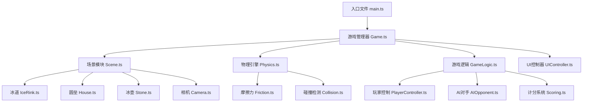

## 1. 技术架构设计



## 2. 技术栈选型

| 类别 | 技术 | 版本 | 说明 |
|------|------|------|------|
| 前端框架 | React | 18.x | UI层框架 |
| 开发语言 | TypeScript | 5.x | 类型安全 |
| 构建工具 | Vite | 5.x | 快速构建 |
| 3D引擎 | Three.js | 0.160.x | WebGL渲染 |
| 样式 | Tailwind CSS | 3.x | 原子化CSS |
| 状态管理 | Zustand | 4.x | 轻量状态管理 |

## 3. 目录结构

```
src/
├── game/                    # 游戏核心模块
│   ├── Game.ts             # 游戏主控制器
│   ├── types.ts            # 类型定义
│   ├── config.ts           # 游戏配置常量
│   ├── scene/              # 场景相关
│   │   ├── Scene.ts        # 场景管理器
│   │   ├── IceRink.ts      # 冰道
│   │   ├── House.ts        # 圆垒
│   │   ├── Stone.ts        # 冰壶
│   │   └── Camera.ts       # 相机控制
│   ├── physics/            # 物理引擎
│   │   ├── Physics.ts      # 物理主循环
│   │   ├── Friction.ts     # 摩擦力计算
│   │   └── Collision.ts    # 碰撞检测
│   └── logic/              # 游戏逻辑
│       ├── PlayerController.ts  # 玩家控制
│       ├── AIOpponent.ts       # AI对手
│       └── Scoring.ts          # 计分系统
├── components/              # React组件
│   ├── GameCanvas.tsx      # 游戏画布
│   ├── ScoreBoard.tsx      # 计分板
│   ├── ControlPanel.tsx    # 控制面板
│   └── PowerBar.tsx        # 力度条
├── store/                   # 状态管理
│   └── useGameStore.ts     # 游戏状态
├── App.tsx                 # 应用入口组件
├── main.tsx                # 入口文件
└── index.css               # 全局样式
```

## 4. 核心类设计

### 4.1 游戏配置 (config.ts)

```typescript
export const GAME_CONFIG = {
  // 冰道尺寸
  RINK_LENGTH: 45,
  RINK_WIDTH: 5,
  
  // 圆垒配置
  HOUSE_RADIUSES: [0.305, 0.61, 0.915, 1.22], // 从内到外
  HOUSE_CENTER_Z: -20, // 圆垒中心位置
  
  // 冰壶配置
  STONE_RADIUS: 0.15,
  STONE_HEIGHT: 0.2,
  STONE_MASS: 1,
  
  // 物理配置
  FRICTION: 0.02, // 摩擦系数
  MIN_VELOCITY: 0.001, // 最小速度阈值
  MAX_POWER: 15, // 最大投掷力度
  
  // 游戏配置
  STONES_PER_PLAYER: 5,
}
```

### 4.2 冰壶类 (Stone.ts)

```typescript
class Stone {
  mesh: THREE.Mesh
  velocity: THREE.Vector2 // x-z平面速度
  isMoving: boolean
  team: 'player' | 'ai'
  
  constructor(team: 'player' | 'ai')
  setPosition(x: number, z: number): void
  setVelocity(vx: number, vz: number): void
  update(deltaTime: number): void
  stop(): void
}
```

### 4.3 物理引擎 (Physics.ts)

```typescript
class Physics {
  stones: Stone[]
  
  addStone(stone: Stone): void
  removeStone(stone: Stone): void
  update(deltaTime: number): void
  applyFriction(stone: Stone, deltaTime: number): void
  checkCollisions(): void
  handleCollision(stone1: Stone, stone2: Stone): void
  allStonesStopped(): boolean
}
```

### 4.4 AI对手 (AIOpponent.ts)

```typescript
class AIOpponent {
  calculateThrow(): { power: number; angle: number }
  aimForHouse(): { power: number; angle: number }
  aimToHit(stones: Stone[]): { power: number; angle: number }
}
```

### 4.5 计分系统 (Scoring.ts)

```typescript
class Scoring {
  static calculateScore(stones: Stone[], houseCenter: THREE.Vector3): {
    playerScore: number
    aiScore: number
    details: { team: string; distance: number; score: number }[]
  }
  static getDistanceScore(distance: number): number
}
```

## 5. 数据模型

```typescript
// 游戏状态
interface GameState {
  phase: 'idle' | 'player_turn' | 'ai_turn' | 'calculating' | 'finished'
  currentRound: number
  playerStonesThrown: number
  aiStonesThrown: number
  playerScore: number
  aiScore: number
  winner: 'player' | 'ai' | 'draw' | null
  isDragging: boolean
  dragStart: { x: number; y: number } | null
  dragCurrent: { x: number; y: number } | null
  throwPower: number
  throwAngle: number
  cameraMode: 'default' | 'follow' | 'top'
}

// 冰壶状态
interface StoneState {
  id: string
  team: 'player' | 'ai'
  position: { x: number; z: number }
  velocity: { x: number; z: number }
  isMoving: boolean
}
```

## 6. 关键算法

### 6.1 摩擦力计算
```
velocity = velocity * (1 - friction * deltaTime)
当 velocity < MIN_VELOCITY 时，设为0
```

### 6.2 碰撞检测与响应
- 距离检测：两冰壶中心距离 < 2 * 半径
- 动量守恒：弹性碰撞，交换法向速度分量

### 6.3 分数计算
- 中心10分，每往外一圈减2分（10, 8, 6, 4）
- 超出最外圈计0分
- 每队取距离最近的冰壶计分

### 6.4 AI策略
- 前两投：瞄准圆垒中心，中等力度
- 中间两投：如果有对方冰壶在得分区，尝试撞击
- 最后一投：根据当前分数决定策略（防守或进攻）
