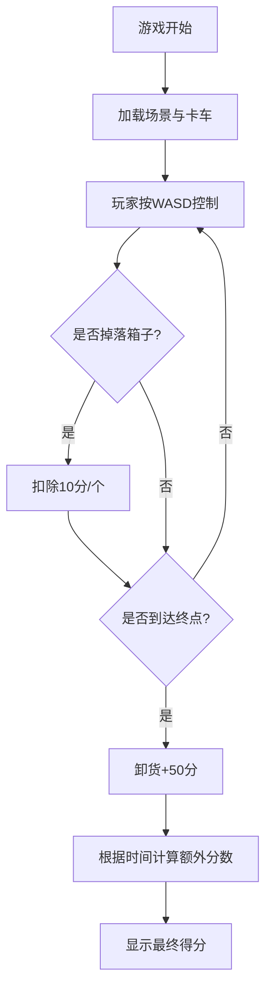

## 1. 产品概述

卡车运输游戏是一款基于Three.js的3D物理模拟驾驶游戏。玩家驾驶卡车在乡下凹凸不平的道路上行驶，运输堆叠的货物到指定区域，挑战在最短时间内安全送达。

- 主要功能：驾驶模拟、货物物理、计分系统
- 目标用户：休闲游戏玩家，喜欢驾驶和物理模拟类游戏
- 产品价值：提供有趣的物理驾驶体验，考验玩家驾驶技巧

## 2. 核心功能

### 2.1 功能模块

1. **游戏主场景**：3D乡村道路环境、卡车、货物
2. **卡车控制系统**：WASD键盘控制、转向、加减速
3. **物理模拟系统**：卡车悬挂、货物晃动与掉落检测
4. **计分系统**：计时、掉落扣分、送达加分
5. **相机系统**：第三人称跟随相机

### 2.2 功能详情

| 模块名称 | 子功能 | 功能描述 |
|----------|--------|----------|
| 游戏主场景 | 道路生成 | 生成凹凸不平、多弯道、上下坡的乡村道路 |
| 游戏主场景 | 环境渲染 | 天空、地面、树木等乡村环境元素 |
| 卡车控制系统 | 键盘输入 | WASD控制卡车前进/后退/转向 |
| 卡车控制系统 | 卡车移动 | 卡车沿道路方向移动，支持加减速 |
| 物理模拟系统 | 悬挂模拟 | 卡车车身在颠簸路面上的晃动 |
| 物理模拟系统 | 货物晃动 | 箱子在转弯和颠簸时的晃动效果 |
| 物理模拟系统 | 掉落检测 | 检测箱子是否掉落到地面 |
| 计分系统 | 计时器 | 记录游戏开始到结束的时间 |
| 计分系统 | 计分逻辑 | 掉落-10分，送达+50分，时间越短分数越高 |
| 相机系统 | 跟随相机 | 第三人称视角跟随卡车移动 |
| 相机系统 | 相机平滑 | 相机跟随平滑过渡 |

## 3. 核心流程

玩家进入游戏后，卡车停在起点，货物已装载在货厢上。玩家按WASD控制卡车沿着乡村道路行驶，需要注意道路的弯道和颠簸。在转弯时货物会因离心力晃动，颠簸时货物会弹跳。如果箱子掉落到地面，每个扣10分。玩家需要尽快将卡车开到黄色卸货区域，到达后自动卸货并获得50分。游戏时间越短，额外奖励分数越高。

## 4. 用户界面设计

### 4.1 设计风格

- 主色调：自然绿色（草地）、土黄色（道路）、蓝色（天空）
- 按钮风格：简洁圆角按钮
- 字体：现代无衬线字体
- 布局：全屏3D场景，HUD信息叠加

### 4.2 HUD界面元素

| 元素 | 位置 | 描述 |
|------|------|------|
| 计时器 | 左上角 | 显示当前游戏时间（秒） |
| 分数显示 | 右上角 | 显示当前得分 |
| 掉落计数 | 右上角分数下方 | 显示已掉落箱子数量 |
| 速度表 | 左下角 | 显示卡车当前速度 |
| 操作提示 | 右下角 | 显示WASD操作说明 |
| 游戏结束界面 | 中央 | 显示最终得分和重新开始按钮 |

### 4.3 3D场景指南

- **环境**：晴朗天空，乡村田野风格
- **光照**：方向光（太阳光）+ 环境光
- **相机**：第三人称跟随，位于卡车后方上方
- **材质**：卡车红色/蓝色，箱子棕色，道路土黄色
- **动画**：卡车行驶震动，箱子晃动，车轮转动

### 4.4 响应式设计

- 桌面优先设计
- 自适应窗口大小
- 键盘操作

## 5. 游戏规则

1. 初始装载3-5个箱子在货厢上
2. WASD控制卡车行驶
3. 转弯过快或颠簸过大可能导致箱子掉落
4. 每掉落一个箱子扣10分
5. 到达黄色卸货区域自动卸货，获得50分
6. 时间越短，最终得分越高（基础分 + 送达分 + 时间奖励）
7. 游戏结束后显示最终得分和统计信息
