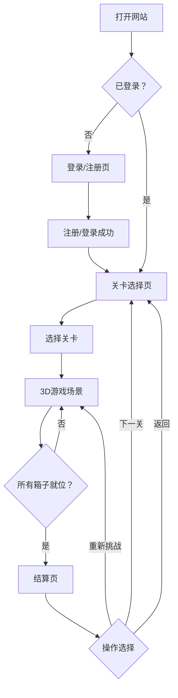

## 1. 产品概述

3D推箱子（Sokoban）是一款经典益智游戏的三维化实现，玩家在方格棋盘上推动箱子到指定位置。产品提供完整的用户系统（注册/登录）、多关卡进度管理、每关用时记录与排行榜功能。

- 目标用户：喜欢益智解谜游戏的休闲玩家，以及希望挑战自己记录的硬核玩家
- 产品价值：以沉浸式3D视角重新体验经典推箱子游戏，通过用时记录激励玩家挑战自我

## 2. 核心功能

### 2.1 用户角色

| 角色 | 注册方式 | 核心权限 |
|------|----------|----------|
| 普通用户 | 邮箱/密码注册 | 游玩所有关卡、查看个人用时记录、参与排行榜 |

### 2.2 功能模块

1. **登录/注册页**：用户注册、登录、表单验证
2. **关卡选择页**：关卡列表、已解锁关卡展示、最佳用时显示
3. **游戏页**：3D游戏场景、棋盘、障碍物、箱子、目标格、玩家角色、移动控制
4. **结算页**：通关用时、步数统计、重新挑战、返回关卡选择
5. **个人中心**：历史记录、各关最佳时间统计

### 2.3 页面详情

| 页面名称 | 模块名称 | 功能描述 |
|----------|----------|----------|
| 登录/注册页 | 登录表单 | 邮箱、密码输入，登录按钮，跳转注册链接 |
| 登录/注册页 | 注册表单 | 用户名、邮箱、密码、确认密码输入，注册按钮 |
| 关卡选择页 | 关卡网格 | 展示所有关卡，显示解锁状态和最佳时间 |
| 关卡选择页 | 关卡卡片 | 关卡编号、最佳用时（秒）、锁定/解锁状态 |
| 游戏页 | 3D游戏场景 | Three.js渲染的俯视角棋盘，箱子、障碍物、目标点、玩家角色 |
| 游戏页 | 控制面板 | WASD/方向键控制移动、重置按钮、退出按钮 |
| 游戏页 | 信息面板 | 当前用时、步数、关卡编号 |
| 结算页 | 成绩展示 | 本次用时、历史最佳时间、是否打破纪录 |
| 结算页 | 操作按钮 | 重新挑战、下一关、返回关卡选择 |

## 3. 核心流程

玩家打开网站进入登录页，注册或登录后进入关卡选择页面。选择一个已解锁关卡进入3D游戏场景，使用WASD或方向键控制角色移动，推动箱子到目标位置。所有箱子到达目标后通关，系统记录用时并展示结算页。玩家可选择重新挑战或返回关卡选择查看个人最佳记录。

## 4. 用户界面设计

### 4.1 设计风格

- **主色调**：深色科技风，主色为深蓝紫 `#6366f1`，辅以青色 `#06b6d4`
- **背景**：深色渐变背景 `#0f172a` 到 `#1e1b4b`
- **按钮风格**：圆角矩形、带有轻微发光效果、悬停动画
- **字体**：标题使用 Orbitron（科技感等宽字体），正文使用 Noto Sans SC
- **布局风格**：卡片式布局、居中对齐、玻璃拟态效果
- **图标**：简洁线条风格图标

### 4.2 页面设计概览

| 页面名称 | 模块名称 | UI元素 |
|----------|----------|--------|
| 登录/注册页 | 表单卡片 | 玻璃拟态卡片、居中布局、渐变边框、输入框带图标 |
| 关卡选择页 | 关卡网格 | 响应式网格布局、卡片hover效果、渐变解锁动画 |
| 游戏页 | 3D场景 | 全屏3D画布、悬浮信息面板、底部控制栏 |
| 游戏页 | 信息面板 | 半透明背景、实时更新计时、发光数字 |
| 结算页 | 成绩卡片 | 大号时间显示、新纪录徽章动画、按钮组 |

### 4.3 3D场景指导

- **环境**：深色空间背景，棋盘平台带发光边缘
- **光照**：环境光 + 方向光，棋盘边缘使用发射光材质
- **相机**：正交相机，俯视45度角，可平滑跟随玩家
- **元素**：
  - 棋盘：半透明蓝色方格平台，目标格高亮为金色
  - 箱子：木质纹理立方体，到位后变为金色并发光
  - 障碍物：灰色砖块纹理立方体
  - 玩家角色：简洁胶囊体或人形模型，带方向指示器
- **交互**：移动时格子间平滑过渡，箱子推动有物理反馈
- **后期处理**：Bloom发光效果、轻微环境光遮蔽

### 4.4 响应式设计

- 桌面端为主（≥1024px）
- 平板端适配（768px-1023px）：3D场景自适应缩放
- 移动端（<768px）：简化控制，使用虚拟方向键
- 触摸优化：游戏页支持虚拟摇杆/方向键
