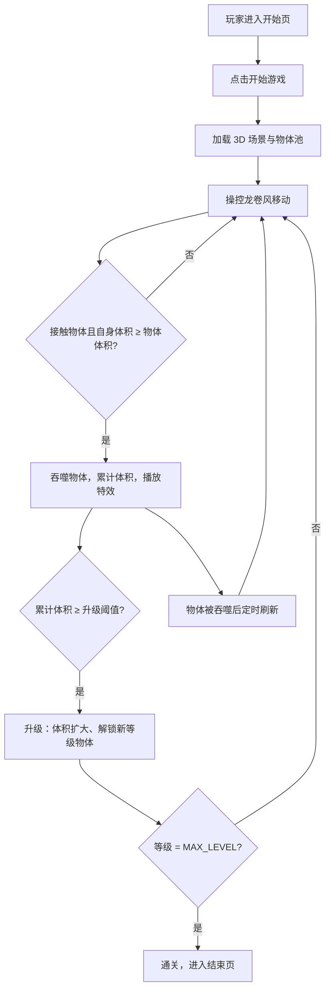

## 1. 产品概述
《龙卷风暴》是一款基于浏览器的 3D 休闲吞噬游戏，玩家操控龙卷风在停车场场景中不断吞噬花草、树木、车辆、房屋等物体，通过升级扩大体积摧毁更大体积的目标，达到最高等级即可通关。
- 目标用户：喜欢轻松解压吞噬玩法的休闲玩家，使用浏览器即可畅玩
- 核心价值：用 Three.js 呈现 3D 龙卷风摧毁停车场的视觉冲击，简洁上手但持续成长

## 2. 核心特性

### 2.1 用户角色
| 角色 | 注册方式 | 核心权限 |
|------|----------|----------|
| 玩家 | 免登录，直接进入游戏 | 操控龙卷风、吞噬物体、查看等级、重新开始 |

### 2.2 功能模块
1. **主界面（开始页）**：标题、玩法说明、开始按钮、最大等级与通关条件提示
2. **游戏主场景**：3D 停车场地图、龙卷风、物体分布、环境光与阴影、风吹粒子
3. **HUD 界面**：当前等级、体积进度条、可吞噬目标提示、剩余时间/刷新提示
4. **结束界面**：通关/失败判定、最终等级、再玩一次

### 2.3 页面详情
| 页面名称 | 模块名称 | 功能描述 |
|----------|----------|----------|
| 主界面 | 开始卡片 | 标题动画、操作说明（WASD / 方向键）、开始按钮、音效开关 |
| 游戏场景 | 3D 地图 | 草地、柏油路面、路灯、停放车辆、房屋、树木、花草 |
| 游戏场景 | 龙卷风 | 跟随鼠标/键盘移动，接触物体时产生吞噬特效与体积成长 |
| 游戏场景 | 物体生成器 | 按等级分层的物体池，被吞噬后自动定时刷新 |
| HUD | 状态栏 | 等级显示、进度条、下一级所需体积、当前可吞噬最高等级物体 |
| HUD | 操作提示 | WASD/方向键移动、空格加速冲刺（可选） |
| 结束界面 | 结算面板 | 通关/重开、最终等级、耗时统计 |

## 3. 核心流程
玩家进入开始页，点击开始后加载 3D 场景。通过键盘/鼠标操控龙卷风移动，接触到体积小于自身的物体时将其吞噬，累计体积达到阈值自动升级；升级后可吞噬更高等级的物体。物体被吞噬后一段时间内会随机刷新新的同类物体。达到最高等级（MAX_LEVEL）即显示通关结束页。

## 4. 用户界面设计
### 4.1 设计风格
- 主色调：深邃夜空蓝 `#0b1026` 作为背景，琥珀黄 `#ffb547` 作为强调色
- 辅助色：风暴青 `#4cc9f0`、吞噬红 `#ff4d6d`
- 按钮风格：圆角玻璃拟态（backdrop-filter），带阴影与悬浮发光
- 字体：标题使用 `Orbitron`，正文使用 `Noto Sans SC`，数字采用等宽
- 布局：HUD 固定在顶部/侧边，3D 场景占满屏幕
- 图标：使用 emoji 配合 Emoji 风格（🌪️🚗🏠🌳🌿）
- 动效：龙卷风旋转、吞噬缩放与粒子飞散、标题漂浮发光

### 4.2 页面设计概览
| 页面名称 | 模块名称 | UI 元素 |
|----------|----------|---------|
| 开始页 | 开始卡片 | 居中大卡片，渐变标题、玩法说明、开始按钮、音效开关 |
| 游戏场景 | 3D 视图 | 全屏 Canvas，相机从斜后上方跟随龙卷风，轻度鼠标控制视角 |
| HUD | 状态栏 | 左上角等级徽章、顶部进度条、右侧操作提示、底部提示气泡 |
| 结束页 | 结算面板 | 居中玻璃卡片、最终等级、耗时、再玩一次按钮、返回主界面 |

### 4.3 响应式
桌面优先，支持 1920×1080 与 1366×768，HUD 使用 rem 单位自适应，移动端保留基本操作但建议桌面体验。

### 4.4 3D 场景指引
- 环境/HDRI：纯色渐变天空 + 环境贴图，风暴氛围，带雾气
- 光照：方向光模拟太阳，开启阴影，暖色补光
- 相机设置：第三人称跟随，相机距离跟随等级扩大
- 构图与焦点：龙卷风位于屏幕中下部，物体散布四周形成目标
- 交互与动画：龙卷风旋转、移动带尾迹，吞噬时物体缩小、粒子飞散
- 后处理：Bloom 发光、轻微晕影增强风暴氛围
- 资源与性能预算：纯程序化几何构建，不依赖外部模型，控制在 300 个物体以内，保持 60fps
