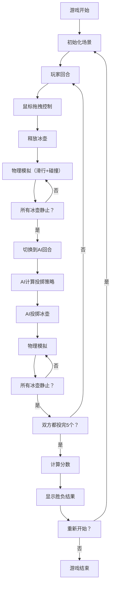

## 1. 产品概述

本产品是一款基于Three.js开发的3D冰壶游戏，玩家通过鼠标操作控制冰壶投掷，与AI对手进行回合制对战。游戏模拟真实冰壶运动的物理效果，包括冰面摩擦力、冰壶碰撞、圆垒计分等核心玩法。

### 1.1 目标用户
- 休闲游戏玩家
- 冰壶运动爱好者
- Three.js技术学习者

### 1.2 产品价值
- 提供沉浸式的3D冰壶游戏体验
- 学习冰壶运动规则和策略
- 展示WebGL/Three.js在游戏开发中的应用

## 2. 核心功能

### 2.1 功能模块

| 模块名称 | 功能描述 |
|----------|----------|
| 3D场景渲染 | 冰道、圆垒、冰壶的3D建模与渲染 |
| 物理引擎 | 冰面摩擦力、速度衰减、碰撞检测 |
| 玩家控制 | 鼠标拖拽控制投掷力度和方向 |
| AI对手 | 简单策略的AI投掷逻辑 |
| 计分系统 | 根据冰壶与圆垒中心距离计算分数 |
| 游戏流程 | 回合制管理、5局比赛、胜负判定 |
| 视角控制 | 多种相机视角切换 |
| UI界面 | 分数显示、操作按钮、游戏状态提示 |

### 2.2 核心玩法

1. **游戏准备**：场景包含长条形冰道，一端有同心圆垒区域
2. **投掷操作**：鼠标向后拖拽冰壶，控制力度和方向，释放后滑出
3. **物理模拟**：冰壶在冰面上滑行，受摩擦力影响逐渐减速
4. **碰撞系统**：冰壶之间可发生碰撞，遵循动量守恒
5. **回合交替**：玩家和AI各投掷5个冰壶，交替进行
6. **计分规则**：所有冰壶静止后，计算距离圆垒中心最近的冰壶得分（中心10分）
7. **胜负判定**：比较双方总分，分数高者获胜

## 3. 核心流程

## 4. 用户界面设计

### 4.1 设计风格
- **主题**：冬季运动风格，以冰蓝色为主色调
- **主色**：#1e88e5（冰蓝色）
- **辅色**：#ffffff（白色）、#e3f2fd（浅蓝）、#ff5722（橙色强调）
- **字体**：现代无衬线字体，清晰易读
- **风格**：简洁现代，3D场景为视觉主体，UI元素半透明悬浮

### 4.2 页面布局

| 区域 | 内容 | 位置 |
|------|------|------|
| 顶部 | 游戏标题、当前回合信息 | 顶部居中 |
| 左侧 | 玩家分数、已投掷数量 | 左上角 |
| 右侧 | AI分数、已投掷数量 | 右上角 |
| 底部 | 操作按钮（重置投掷、切换视角、重新开始）、力度指示条 | 底部居中 |
| 中心 | 3D游戏场景 | 全屏 |

### 4.3 UI元素
- **按钮**：圆角矩形，半透明背景，悬停时有缩放和发光效果
- **分数面板**：半透明卡片，带有模糊背景效果
- **力度条**：横向进度条，颜色从绿色到红色渐变
- **状态提示**：浮动文字提示，显示当前操作引导

### 4.4 3D场景设计
- **冰道**：长45米、宽5米的矩形，带有冰面纹理和划痕效果
- **圆垒**：4个同心圆环，直径分别为0.61m、1.22m、1.83m、2.44m，颜色从内到外为白、蓝、白、红
- **冰壶**：圆柱体，直径0.3m，高度0.2m，带有手柄和大理石纹理
- **光照**：环境光+方向光，模拟室内冰场照明效果
- **相机**：
  - 默认视角：斜上方45度俯瞰
  - 第一视角：跟随冰壶
  - 顶视图：正上方俯视

## 5. 技术约束

- 基于Three.js实现3D渲染
- 不使用物理引擎库，手动实现简单物理
- 代码按功能模块划分文件
- 支持桌面端浏览器运行
- 响应式设计，适配不同屏幕尺寸
