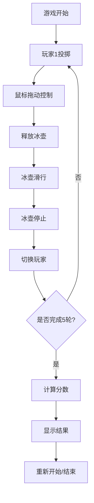

## 1. 产品概述
3D冰壶游戏，模拟真实冰壶运动体验，支持双人交替对战，通过鼠标操作控制冰壶的力度和方向。
- 主要用途：休闲娱乐，体验冰壶运动乐趣
- 目标用户：休闲游戏玩家、冰壶运动爱好者

## 2. 核心功能

### 2.1 用户角色
| 角色 | 注册方式 | 核心权限 |
|------|----------|----------|
| 玩家 | 无需注册 | 进行游戏、查看分数 |

### 2.2 功能模块
1. **游戏主场景**：3D冰道、圆垒、冰壶模型
2. **操控系统**：鼠标拖动控制力度和方向
3. **物理系统**：冰壶滑行、碰撞、摩擦模拟
4. **视角系统**：跟随视角、目标位置小窗口预览
5. **计分系统**：根据距离中心计算分数
6. **游戏流程**：双人交替5轮对战

### 2.3 页面详情
| 页面名称 | 模块名称 | 功能描述 |
|----------|----------|----------|
| 游戏主页面 | 3D场景渲染 | 渲染冰道、冰壶、圆垒等3D元素 |
| 游戏主页面 | 控制面板 | 显示当前轮次、玩家、分数信息 |
| 游戏主页面 | 力度指示器 | 显示当前拖动力度大小 |
| 游戏主页面 | 目标预览窗口 | 小窗口显示目标区域冰壶状况 |
| 游戏主页面 | 游戏结束面板 | 显示最终分数和胜负结果 |

## 3. 核心流程
玩家进入游戏后，交替进行5轮投掷。每轮通过鼠标向后拖动控制力度和方向，释放后冰壶滑出。冰壶停止后切换玩家，所有轮次结束后计算总分判定胜负。

## 4. 用户界面设计

### 4.1 设计风格
- **主色调**：冰蓝色(#4FC3F7)、白色(#FFFFFF)、深灰色(#37474F)
- **按钮风格**：圆角设计，带冰蓝色渐变和发光效果
- **字体**：现代无衬线字体，标题加粗
- **布局风格**：沉浸式3D场景为主，UI元素悬浮于场景之上
- **图标风格**：简洁线性图标，冰蓝色主题

### 4.2 页面设计概览
| 页面名称 | 模块名称 | UI元素 |
|----------|----------|--------|
| 游戏主页面 | 3D场景 | 冰道、灯光、阴影、冰壶动画 |
| 游戏主页面 | 信息面板 | 半透明背景、圆角、模糊效果 |
| 游戏主页面 | 力度条 | 渐变色进度条，从绿到红表示力度 |
| 游戏主页面 | 预览窗口 | 右上角小窗口，带边框 |

### 4.3 响应性
- 桌面端优先设计，支持全屏游戏体验
- UI元素采用固定定位，不随3D场景移动
- 自适应不同屏幕分辨率

### 4.4 3D场景指导
- **环境**：冷色调，模拟冰场氛围，添加轻微冰面反光
- **灯光**：主光源+环境光，产生柔和阴影
- **相机**：默认第三人称视角，投掷后跟随冰壶移动
- **材质**：冰面采用高反光材质，冰壶使用光滑塑料质感
- **后处理**：轻微泛光效果，增强科技感
