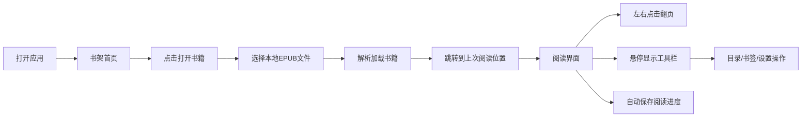

## 1. 产品概述

网页版EPUB阅读器，支持本地EPUB文件导入与阅读，提供沉浸式阅读体验，包含目录导航、书签管理、主题切换等核心功能。

- 主要用途：在浏览器中阅读本地EPUB格式电子书，无需安装软件
- 目标用户：喜欢在线阅读电子书、注重阅读体验的用户群体
- 产品价值：轻量、跨平台、隐私安全（本地解析不依赖服务端）

## 2. 核心功能

### 2.1 用户角色

| 角色 | 注册方式 | 核心权限 |
|------|----------|----------|
| 普通用户 | 无需注册 | 打开本地EPUB文件、阅读、添加书签、调整阅读设置 |

### 2.2 功能模块

1. **书架首页**：打开书籍按钮、书籍选择
2. **阅读界面**：正文展示、翻页、工具栏、进度条、目录面板、书签功能
3. **设置系统**：字体大小调节、主题切换
4. **数据存储**：阅读进度保存、书签持久化

### 2.3 页面详情

| 页面名称 | 模块名称 | 功能描述 |
|----------|----------|----------|
| 书架首页 | 打开书籍按钮 | 点击选择本地EPUB文件，加载后进入阅读界面 |
| 书架首页 | 空状态提示 | 引导用户点击打开书籍 |
| 阅读界面 | 正文区域 | 展示EPUB正文内容，最大宽度800px居中，行间距1.8，段落间距1.2em，首行缩进2em |
| 阅读界面 | 翻页热区 | 左右两侧半透明点击区域，左侧翻上一页，右侧翻下一页，平滑滑动过渡动画 |
| 阅读界面 | 顶部工具栏 | 悬停滑出，包含书名、返回书架、目录、书签、字体大小、主题切换 |
| 阅读界面 | 底部进度条 | 显示阅读百分比，支持拖拽跳转 |
| 阅读界面 | 目录面板 | 左侧滑出，章节目录树多级缩进，点击跳转，当前章节高亮 |
| 阅读界面 | 书签功能 | 添加/取消书签，书签列表展示，localStorage持久化 |
| 阅读界面 | 阅读进度 | 自动保存进度，下次打开自动跳转，3秒提示条 |

## 3. 核心流程

用户打开应用 → 点击"打开书籍"选择本地EPUB文件 → 解析加载书籍 → 自动跳转到上次阅读位置（显示提示） → 左右点击/滑动翻页 → 悬停顶部显示工具栏 → 点击目录按钮查看目录 → 点击书签添加书签 → 关闭浏览器后进度和书签保留

## 4. 用户界面设计

### 4.1 设计风格

- 整体风格：简约优雅，专注阅读体验
- 设计理念：内容优先，减少干扰，沉浸阅读
- 三种阅读主题：
  - 白色主题：背景#ffffff、文字#333333
  - 护眼主题：背景#f5efdc、文字#5b4636
  - 夜间主题：背景#1a1a1a、文字#999999
- 字体：系统默认serif字体
- 动画：平滑过渡，翻页滑动效果

### 4.2 页面设计概览

| 页面名称 | 模块名称 | UI元素 |
|----------|----------|--------|
| 书架首页 | 主区域 | 居中的打开书籍按钮，简洁大方，引导式设计 |
| 阅读界面 | 正文区域 | 最大800px居中，两侧留白，优雅排版 |
| 阅读界面 | 翻页热区 | 半透明，悬停时有微弱视觉反馈 |
| 阅读界面 | 顶部工具栏 | 高度48px，默认隐藏，悬停滑入，半透明背景 |
| 阅读界面 | 底部进度条 | 高度4px，可拖拽，实时显示百分比 |
| 阅读界面 | 目录面板 | 左侧滑出，多级缩进，当前章节高亮 |
| 阅读界面 | 书签图标 | 页面右上角小书签标识，书签列表下拉展示 |

### 4.3 响应式

- 桌面端优先设计
- 适配平板和移动端屏幕
- 触摸设备支持左右滑动翻页

### 4.4 动效设计

- 翻页：平滑滑动过渡动画（左右方向）
- 工具栏：悬停时从顶部滑入
- 目录面板：从左侧滑出，正文区域自适应变窄
- 提示条：淡入淡出，3秒后自动消失
- 主题切换：平滑颜色过渡
