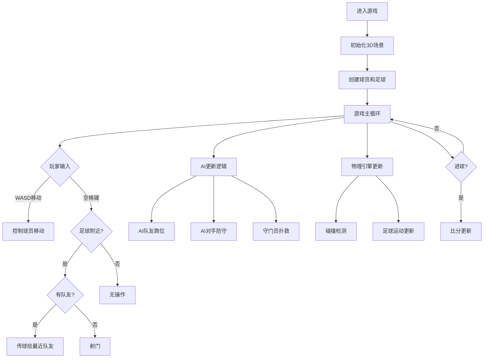

## 1. 产品概述

一款基于Web的3V3 3D足球游戏，玩家可以控制自己队伍的球员进行运球、传球、射门操作，AI控制的队友和对手进行配合和防守，AI守门员守卫球门。

- 目标用户：喜欢休闲体育游戏的玩家
- 产品价值：提供简单有趣的3D足球竞技体验，支持单人对战AI

## 2. 核心功能

### 2.1 用户角色
| 角色 | 说明 | 核心权限 |
|------|------|----------|
| 玩家 | 控制己方队伍的一名球员 | 运球、传球、射门、切换控制球员 |

### 2.2 功能模块
1. **游戏主界面**：3D足球场地、球员、足球、比分显示
2. **玩家控制系统**：键盘WASD移动、空格传球/射门、Shift加速
3. **AI队友系统**：自动跑位、接应、射门
4. **AI对手系统**：自动防守、抢断、进攻
5. **AI守门员系统**：自动扑救、守门
6. **足球物理系统**：碰撞、弹跳、滚动

### 2.3 页面详情
| 页面名称 | 模块名称 | 功能描述 |
|----------|----------|----------|
| 游戏主界面 | 3D场景 | 渲染足球场、球员、足球，实时更新游戏状态 |
| 游戏主界面 | HUD界面 | 显示比分、时间、控制说明、队伍信息 |
| 游戏主界面 | 游戏控制 | 处理玩家输入，控制球员移动和动作 |

## 3. 核心流程

玩家进入游戏后，3V3对战开始。玩家控制己方队伍的一名球员，使用WASD移动，接近足球时可以运球，按空格键传球给队友或射门得分。AI队友自动跑位接应，对手AI进行防守和抢断，守门员自动守门。进球后比分更新，比赛继续。

## 4. 用户界面设计

### 4.1 设计风格
- 主色调：绿色（足球场）、白色（线条）
- 辅助色：蓝色（己方队伍）、红色（对方队伍）
- 按钮样式：圆角矩形，半透明
- 字体：无衬线字体，清晰易读
- 布局：3D场景居中，HUD信息在屏幕边缘
- 图标：使用简洁的几何图形

### 4.2 页面设计概览
| 页面名称 | 模块名称 | UI元素 |
|----------|----------|----------|
| 游戏主界面 | 3D场景 | 绿色足球场、球员模型、足球模型、动态光影 |
| 游戏主界面 | 顶部HUD | 比分显示、时间显示、暂停按钮 |
| 游戏主界面 | 底部HUD | 控制说明、队伍信息 |

### 4.3 响应式设计
- 桌面端优先设计
- 全屏显示3D场景
- 键盘控制为主

### 4.4 3D场景指南
- 环境：日间足球场，明亮光照
- 光照：主方向光+环境光，模拟阳光
- 相机：第三人称跟随视角，跟随控球球员
- 构图：足球场为主要场景，球员和足球为焦点
- 交互：球员移动动画、足球弹跳动画、射门动作
- 后期效果：轻微泛光、阴影
