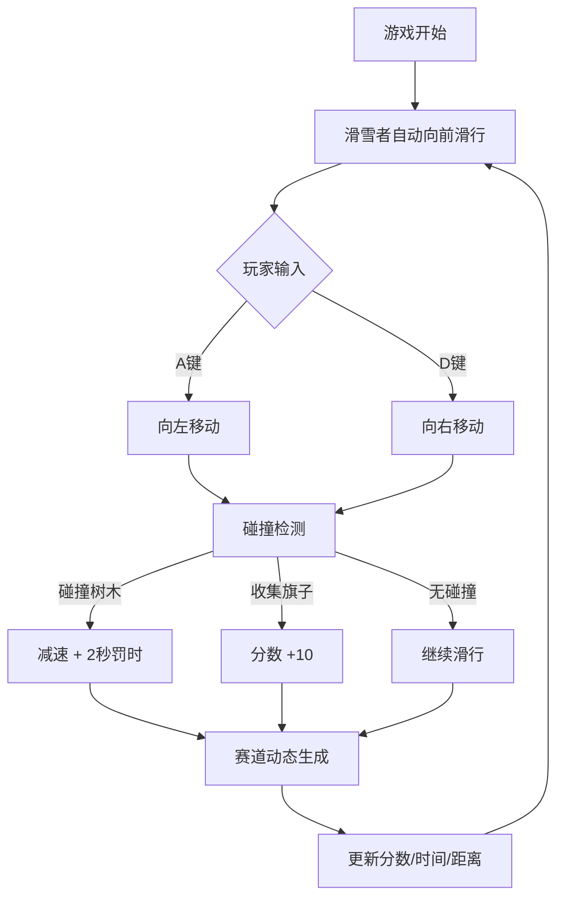

## 1. 产品概述

滑雪竞速游戏是一款使用Three.js开发的3D休闲竞速游戏。玩家控制滑雪者在下坡雪道上滑行，躲避树木障碍，收集彩色旗子获取分数，体验速度与激情的冰雪世界。

- 核心玩法：自动向前滑行，左右移动躲避障碍并收集旗子
- 目标用户：休闲游戏玩家，喜欢简单易上手的3D游戏
- 产品价值：提供轻松有趣的滑雪竞速体验，考验玩家的反应能力

## 2. 核心功能

### 2.1 功能模块

1. **游戏主场景**：3D下坡雪道、两侧树木、动态赛道生成
2. **玩家控制**：圆锥体滑雪者、AD键左右移动、自动向前滑行
3. **碰撞系统**：树木碰撞检测（减速+2秒罚时）、旗子收集检测（+10分）
4. **计分计时系统**：实时分数显示、计时器、最远距离统计
5. **视觉效果**：雪花粒子系统、速度感表现、第三人称跟随相机
6. **赛道系统**：无限延伸的动态赛道段生成

### 2.2 页面详情

| 页面名称 | 模块名称 | 功能描述 |
|-----------|-------------|---------------------|
| 游戏主界面 | 3D场景渲染 | 下坡雪道、树木、旗子、滑雪者渲染 |
| 游戏主界面 | HUD显示 | 分数、时间、距离实时显示 |
| 游戏主界面 | 控制系统 | 键盘AD键控制左右移动 |
| 游戏主界面 | 粒子系统 | 雪花粒子效果 |

## 3. 核心流程

玩家进入游戏 → 滑雪者自动向前滑行 → 玩家按AD键左右移动 → 躲避树木障碍（碰撞则减速+罚时）→ 收集旗子获得分数 → 赛道无限生成延伸 → 显示实时分数和时间

## 4. 用户界面设计

### 4.1 设计风格

- **主色调**：冰雪蓝白色系，营造寒冷的雪地氛围
- **辅助色**：旗子使用红、黄、蓝、绿等鲜艳色彩，便于识别
- **字体**：现代无衬线字体，清晰易读
- **视觉风格**：简洁明快的3D卡通风格，低多边形树木和场景

### 4.2 页面设计概述

| 页面名称 | 模块名称 | UI元素 |
|-----------|-------------|-------------|
| 游戏主界面 | 3D场景 | 白色雪道、绿色树木、彩色旗子、蓝色滑雪者 |
| 游戏主界面 | HUD | 左上角分数、右上角时间、底部操作提示 |
| 游戏主界面 | 粒子效果 | 白色雪花粒子从空中飘落 |

### 4.3 3D场景设计

- **环境**：蓝天背景，远山轮廓，营造开阔的滑雪场景
- **光照**：方向光模拟太阳光，柔和的环境光
- **相机**：第三人称背后跟随，略微俯视角度，提供良好的视野
- **速度感**：雪道纹理滚动、粒子加速效果、相机轻微震动
- **后处理**：轻微的泛光效果，增强雪地的明亮感
