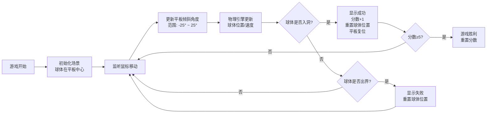

## 1. 产品概述

平衡球游戏是一款基于Three.js的3D物理休闲游戏。玩家通过鼠标操控平板倾斜角度，引导金属球滚入目标洞中，考验玩家的操作技巧和耐心。

- 核心玩法：通过鼠标移动控制平板倾斜，利用物理引擎模拟球体滚动
- 目标用户：休闲游戏玩家，喜欢物理益智类游戏的用户
- 产品价值：提供轻松有趣的物理游戏体验，锻炼手眼协调能力

## 2. 核心功能

### 2.1 用户角色
无需用户登录，单玩家游戏模式。

### 2.2 功能模块
1. **游戏主场景**：3D平板、金属球、目标洞的渲染与交互
2. **物理系统**：重力、摩擦、碰撞检测
3. **控制系统**：鼠标输入映射到平板倾斜角度
4. **计分系统**：成功次数统计、游戏状态管理
5. **UI界面**：倾斜角度显示、得分、游戏状态提示

### 2.3 页面详情

| 页面名称 | 模块名称 | 功能描述 |
|-----------|-------------|---------------------|
| 游戏主页面 | 3D场景渲染 | 渲染平板、球体、目标洞，实时更新物理状态 |
| 游戏主页面 | 输入控制 | 监听鼠标移动，计算平板倾斜角度 |
| 游戏主页面 | 物理引擎 | 模拟球体滚动、重力、摩擦、碰撞 |
| 游戏主页面 | 游戏逻辑 | 检测进球、出界、重置游戏、计分 |
| 游戏主页面 | UI显示 | 显示X/Y轴倾斜角度、得分、游戏状态提示 |

## 3. 核心流程

## 4. 用户界面设计

### 4.1 设计风格
- **设计方向**：极简科技风，金属质感与现代简约结合
- **主色调**：深蓝色背景 (#0a1628)，金属银色球体，暗金色平板边框
- **辅助色**：翠绿色成功提示 (#00ff88)，橙红色失败提示 (#ff5544)
- **字体**：JetBrains Mono 等宽字体，数字显示清晰锐利
- **视觉效果**：环境光反射、球体金属质感、柔和阴影

### 4.2 页面设计概述

| 页面名称 | 模块名称 | UI元素 |
|-----------|-------------|-------------|
| 游戏主页面 | 3D场景 | 金属质感平板(带网格纹理)、高光金属球、角落圆环目标洞、柔和阴影 |
| 游戏主页面 | 角度指示器 | 左上角显示X轴和Y轴倾斜角度，带正负方向指示 |
| 游戏主页面 | 分数显示 | 右上角显示当前得分 (0/5) |
| 游戏主页面 | 状态提示 | 中央浮动显示"成功"/"失败"文字，带渐入渐出动画 |
| 游戏主页面 | 操作提示 | 底部显示"移动鼠标控制平板倾斜" |

### 4.3 响应式
- 桌面端优先，全屏Canvas渲染
- 自适应窗口大小，保持正确的宽高比
- 支持窗口大小变化时自动调整渲染尺寸

### 4.4 3D场景指导
- **环境**：深色渐变背景，模拟室内环境光
- **光照**：主方向光 + 环境光 + 半球光，营造金属质感
- **相机**：透视相机，45°俯视角度，跟随球体轻微移动
- **材质**：球体使用MeshStandardMaterial(金属度0.9，粗糙度0.1)，平板使用MeshStandardMaterial(金属度0.3，粗糙度0.5)
- **后处理**：轻微泛光效果，增强视觉层次
