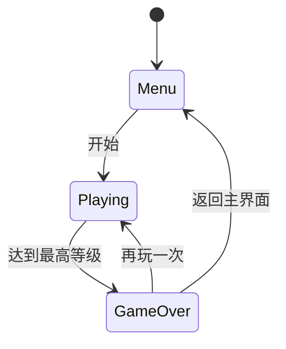

## 1. 架构设计
```mermaid
flowchart LR
  subgraph 前端 "前端 (Vite + React18 + TS)"
    UI["UI 层（TailwindCSS + React 组件）"]
    R3F["3D 层（@react-three/fiber + drei）"]
    Game["游戏逻辑层（useGame hook）"]
    State["状态管理（zustand）"]
  end
  UI --> Game
  R3F --> Game
  Game --> State
```

## 2. 技术说明
- 前端：React@18 + TypeScript + TailwindCSS@3 + Vite
- 3D：three、@react-three/fiber、@react-three/drei、@react-three/postprocessing
- 状态管理：zustand
- 构建：vite-init（手动初始化）
- 后端：无
- 数据库：无（纯前端游戏，使用内存状态）

## 3. 路由定义
| 路由 | 用途 |
|------|------|
| / | 开始页 → 游戏页 → 结束页（由游戏状态切换，非路由） |

说明：游戏内页面切换通过状态机（menu / playing / gameover）完成，不引入 react-router。

## 4. 数据模型
### 4.1 物体等级与体积表
| 物体 | 体积权重 | 最低可吞噬等级 | 视觉 |
|------|----------|----------------|------|
| 花草 | 1 | 1 | 绿色小草 |
| 小树 | 3 | 1 | 细干小冠 |
| 行人 | 4 | 2 | 胶囊人形 |
| 灌木 | 5 | 2 | 球形灌木 |
| 垃圾桶 | 8 | 3 | 金属柱 |
| 小汽车 | 15 | 3 | 长方体车身 |
| 大树 | 25 | 4 | 高干宽冠 |
| 路灯 | 30 | 4 | 路灯柱 |
| 货车 | 60 | 5 | 大长方体 |
| 小屋 | 120 | 6 | 带屋顶立方体 |
| 高楼 | 300 | 7 | 多层大楼 |

### 4.2 玩家状态
- `level: number`（1..MAX_LEVEL）
- `volume: number`（当前累计体积）
- `threshold: number`（升级阈值）
- `position: [x,y,z]`
- `velocity: [x,y,z]`

## 5. 状态机

