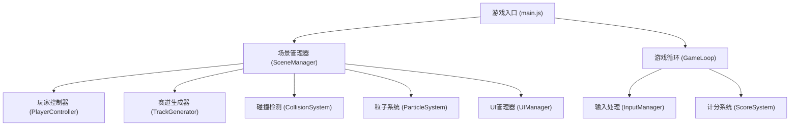

## 1. 架构设计

## 2. 技术描述

- **前端框架**：原生JavaScript + Three.js（r160+）
- **构建工具**：Vite
- **3D引擎**：Three.js
- **样式**：原生CSS
- **模块管理**：ES Modules

## 3. 模块划分

### 3.1 核心模块

| 文件路径 | 模块名称 | 职责描述 |
|-----------|-------------|---------------------|
| `src/main.js` | 游戏入口 | 初始化游戏，启动主循环 |
| `src/core/Game.js` | 游戏主类 | 整合所有模块，控制游戏流程 |
| `src/core/SceneManager.js` | 场景管理器 | Three.js场景、相机、渲染器初始化 |
| `src/core/InputManager.js` | 输入管理器 | 键盘事件监听和处理 |
| `src/core/GameLoop.js` | 游戏循环 | requestAnimationFrame主循环 |
| `src/entities/Player.js` | 玩家实体 | 滑雪者模型、移动逻辑 |
| `src/entities/Tree.js` | 树木实体 | 树木模型生成 |
| `src/entities/Flag.js` | 旗子实体 | 旗子模型生成 |
| `src/systems/TrackGenerator.js` | 赛道生成器 | 动态生成赛道段、树木、旗子 |
| `src/systems/CollisionSystem.js` | 碰撞系统 | 碰撞检测和处理 |
| `src/systems/ParticleSystem.js` | 粒子系统 | 雪花粒子效果 |
| `src/systems/ScoreSystem.js` | 计分系统 | 分数、时间、距离统计 |
| `src/ui/UIManager.js` | UI管理器 | HUD显示、分数、时间更新 |
| `src/utils/constants.js` | 常量配置 | 游戏参数配置 |
| `src/utils/helpers.js` | 工具函数 | 通用辅助函数 |

## 4. 技术要点

### 4.1 无限赛道实现
- 使用对象池（Object Pool）管理赛道段
- 当滑雪者超过某段赛道时，将其回收并重新放置到前方
- 树木和旗子跟随赛道段一起生成和回收

### 4.2 碰撞检测
- 使用简单的球体/盒子碰撞检测
- 玩家与树木：距离检测，小于阈值则触发碰撞
- 玩家与旗子：距离检测，小于阈值则收集

### 4.3 性能优化
- 复用几何体和材质，避免重复创建
- 限制可见范围外的对象渲染
- 粒子系统使用BufferGeometry提升性能

### 4.4 速度感实现
- 相机FOV随速度变化
- 雪花粒子速度随游戏速度调整
- 雪道纹理滚动效果
