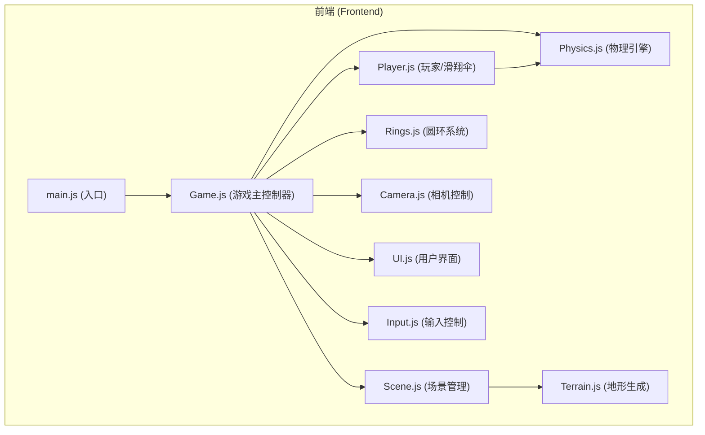

## 1. 架构设计



## 2. 技术描述

- **前端框架**：原生 JavaScript (ES6+) + Three.js
- **构建工具**：Vite
- **3D引擎**：Three.js (r160+)
- **样式**：原生 CSS
- **无需后端**：纯前端游戏，数据存储在本地内存

## 3. 目录结构

```
src/
├── main.js              # 入口文件，初始化游戏
├── game/
│   ├── Game.js          # 游戏主循环与状态管理
│   ├── Scene.js         # 场景、光照、环境管理
│   ├── Terrain.js       # 山脉地形生成（Perlin噪声）
│   ├── Player.js        # 滑翔伞模型与控制
│   ├── Physics.js       # 空气动力学物理模拟
│   ├── Rings.js         # 发光圆环生成与碰撞检测
│   ├── Camera.js        # 第三人称跟随相机
│   ├── Input.js         # 键盘+鼠标输入处理
│   └── UI.js            # 分数、能量条、UI渲染
├── styles/
│   └── main.css         # 全局样式
└── utils/
    └── math.js          # 数学工具函数
```

## 4. 模块定义

### 4.1 Game.js (游戏主控制器)
```javascript
class Game {
  constructor()
  init()          // 初始化所有模块
  start()         // 开始游戏
  update()        // 游戏主循环
  restart()       // 重新开始
  gameOver()      // 游戏结束
}
```

### 4.2 Scene.js (场景管理)
```javascript
class SceneManager {
  constructor()
  init()          // 创建场景、相机、渲染器
  setupLights()   // 设置光照
  setupFog()      // 设置雾化
  render()        // 渲染场景
}
```

### 4.3 Terrain.js (地形生成)
```javascript
class Terrain {
  constructor(scene)
  generate()      // 使用Perlin噪声生成随机高度
  getHeight(x, z) // 获取指定位置的地形高度
}
```

### 4.4 Player.js (玩家控制)
```javascript
class Player {
  constructor(scene)
  createModel()   // 创建滑翔伞模型
  update(input, dt) // 更新位置和姿态
  reset()         // 重置到起点
}
```

### 4.5 Physics.js (物理引擎)
```javascript
class Physics {
  constructor(player)
  update(dt)      // 计算升力、阻力、速度
  calculateLift() // 基于攻角和速度计算升力
  calculateDrag() // 计算阻力
}
```

### 4.6 Rings.js (圆环系统)
```javascript
class RingSystem {
  constructor(scene)
  spawnRing()     // 生成新圆环
  checkCollision(player) // 碰撞检测
  reset()         // 重置所有圆环
}
```

### 4.7 Camera.js (相机控制)
```javascript
class FollowCamera {
  constructor(camera)
  update(target, dt) // 平滑跟随目标
}
```

## 5. 数据模型

### 5.1 游戏状态
```javascript
{
  score: number,        // 当前分数
  energy: number,       // 能量值 (0-100)
  isPlaying: boolean,   // 是否正在游戏
  isGameOver: boolean,  // 是否游戏结束
}
```

### 5.2 玩家状态
```javascript
{
  position: Vector3,    // 位置
  velocity: Vector3,    // 速度
  rotation: Euler,      // 姿态（俯仰、偏航、滚转）
  speed: number,        // 当前速度
  angleOfAttack: number // 攻角
}
```
