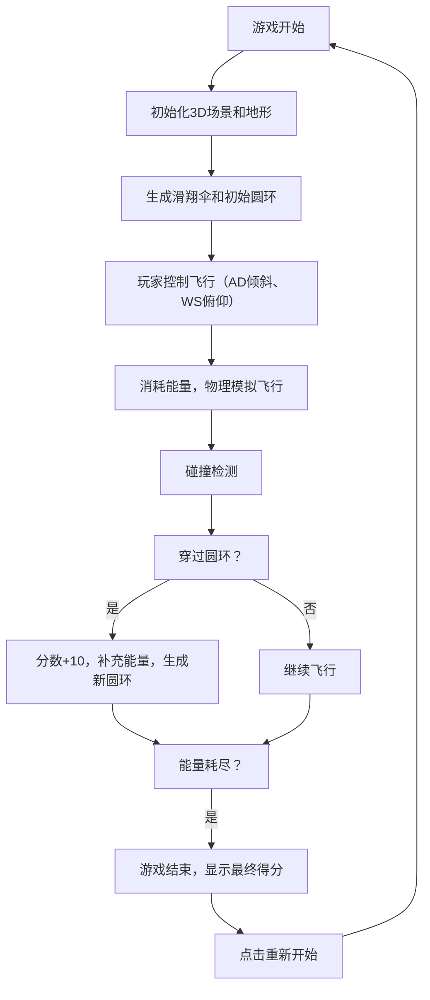

## 1. 产品概述

基于 Three.js 开发的 3D 滑翔伞飞行游戏，玩家驾驶滑翔伞穿越随机生成的山脉地形，在空中收集发光圆环获得分数和能量。游戏融合空气动力学物理模拟，带来真实的飞行体验。

- 核心玩法：驾驶滑翔伞穿越圆环，管理能量条，挑战高分
- 目标用户：休闲游戏玩家，3D游戏爱好者

## 2. 核心特性

### 2.2 功能模块

1. **游戏场景模块**：随机高度山脉地形、天空环境、光照系统
2. **玩家控制模块**：滑翔伞模型、俯仰/倾斜控制、键盘+鼠标输入
3. **物理引擎模块**：空气动力学模拟（升力、阻力、攻角）
4. **道具系统模块**：发光圆环生成、碰撞检测、得分与能量补充
5. **相机系统模块**：第三人称跟随相机
6. **UI界面模块**：分数显示、能量条、重新开始按钮
7. **游戏状态模块**：游戏循环、开始/结束状态管理

### 2.3 页面详情

| 页面名称 | 模块名称 | 功能描述 |
|-----------|-------------|---------------------|
| 游戏主页面 | 3D场景 | 渲染山脉地形、滑翔伞、发光圆环 |
| 游戏主页面 | UI层 | 分数显示、能量条、操作提示、重新开始按钮 |
| 游戏结束弹窗 | 结束界面 | 最终得分展示、重新开始按钮 |

## 3. 核心流程

## 4. 用户界面设计

### 4.1 设计风格
- **整体风格**：科幻休闲风格，明亮的天空与深邃的山脉形成对比
- **主色调**：天空蓝 (#87CEEB)、山脉棕绿 (#556B2F)、圆环金色 (#FFD700)
- **UI风格**：半透明深色背景，简洁现代的字体
- **动效**：圆环脉冲发光、相机平滑跟随、能量条渐变过渡

### 4.2 页面设计概述

| 页面名称 | 模块名称 | UI元素 |
|-----------|-------------|-------------|
| 游戏主页面 | 分数显示 | 右上角金色数字，实时更新 |
| 游戏主页面 | 能量条 | 左上角水平进度条，绿色渐变到红色 |
| 游戏主页面 | 操作提示 | 底部半透明提示文字 |
| 游戏结束弹窗 | 结束界面 | 居中显示最终得分和重新开始按钮 |

### 4.3 响应式
- 桌面端全屏Canvas，鼠标+键盘控制
- 移动端采用触摸控制（可选扩展）

### 4.4 3D场景指导
- **环境**：晴朗天空，远景雾化效果
- **光照**：方向光模拟太阳光，环境光提供基础照明
- **相机**：第三人称跟随，位于滑翔伞后上方，平滑跟随
- **特效**：圆环自发光材质，山脉顶点着色
- **性能**：使用BufferGeometry，合理控制多边形数量
