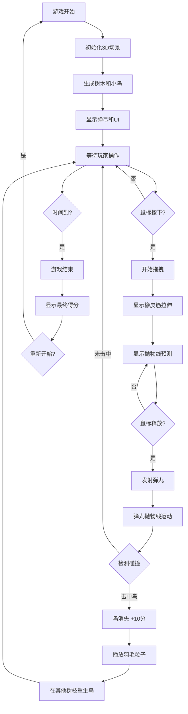

## 1. 产品概述

弹弓打鸟是一款基于 Three.js 的 3D 休闲射击游戏，玩家通过拖拽弹弓发射弹丸击中树枝上的小鸟来获得分数。限时 60 秒，考验玩家的瞄准技巧和反应速度。

- 目标用户：喜欢休闲小游戏的各年龄段玩家
- 产品价值：提供简单有趣的 3D 游戏体验，锻炼手眼协调能力

## 2. 核心功能

### 2.1 功能模块

1. **游戏主界面**：3D 游戏场景、UI 信息面板、游戏控制
2. **场景元素**：低多边形树木、彩色小鸟、弹弓
3. **交互系统**：鼠标拖拽控制、力度方向检测、弹丸发射
4. **游戏逻辑**：碰撞检测、计分系统、计时器、鸟重生机制
5. **视觉效果**：橡皮筋拉伸、抛物线预测、羽毛粒子特效

### 2.2 功能详情

| 模块名称 | 子模块 | 功能描述 |
|---------|--------|----------|
| 3D 场景 | 树木生成 | 生成多棵低多边形风格的树木分布在场景中 |
| 3D 场景 | 小鸟生成 | 在树枝上随机位置生成彩色小鸟 |
| 交互系统 | 拖拽控制 | 按住鼠标向后拖拽弹弓，显示橡皮筋拉伸效果 |
| 交互系统 | 力度计算 | 根据拖拽距离计算弹丸发射力度 |
| 交互系统 | 方向计算 | 根据拖拽方向计算弹丸发射角度 |
| 交互系统 | 抛物线预测 | 实时显示弹丸飞行轨迹预测线 |
| 游戏逻辑 | 弹丸运动 | 实现真实的抛物线物理运动 |
| 游戏逻辑 | 碰撞检测 | 弹丸与鸟的包围盒碰撞检测 |
| 游戏逻辑 | 计分系统 | 击中鸟得 10 分，实时显示分数 |
| 游戏逻辑 | 计时器 | 60 秒倒计时，时间结束游戏结束 |
| 游戏逻辑 | 鸟重生 | 被击中的鸟在其他树枝重新生成 |
| 视觉效果 | 粒子特效 | 击中鸟时播放羽毛粒子效果 |
| UI 界面 | 信息面板 | 显示当前分数、剩余时间 |
| UI 界面 | 游戏结束 | 显示最终得分和重新开始按钮 |

## 3. 核心流程

## 4. 用户界面设计

### 4.1 设计风格

- **主色调**：天空蓝 (#87CEEB)、森林绿 (#228B22)、大地棕 (#8B4513)
- **辅助色**：多种鲜艳色彩用于小鸟（红、黄、蓝、绿、紫）
- **3D 风格**：低多边形 (Low Poly) 风格，简洁几何造型
- **字体**：使用可爱圆润的无衬线字体，适合游戏氛围
- **UI 风格**：半透明玻璃拟态面板，圆角设计

### 4.2 3D 场景设计

| 元素 | 设计要点 |
|-----|----------|
| 环境 | 晴朗天空、草地地面、柔和自然光 |
| 树木 | 低多边形风格，简化的树干和树冠 |
| 小鸟 | 简单几何体组合，鲜艳色彩，轻微摆动动画 |
| 弹弓 | Y 形木质弹弓，位于画面左下角 |
| 相机 | 侧后方固定视角，略微俯视角度 |

### 4.3 交互细节

- 拖拽时橡皮筋从弹弓端点延伸到鼠标位置
- 抛物线预测线使用虚线，随拖拽实时更新
- 弹丸为小钢球样式，带轨迹拖尾
- 击中时羽毛粒子向四周飘散
- 小鸟有轻微的上下浮动和翅膀扇动动画

### 4.4 UI 布局

| 位置 | 元素 |
|-----|------|
| 左上角 | 分数显示 |
| 右上角 | 倒计时显示 |
| 画面中央 | 游戏结束弹窗（游戏结束时显示） |
| 左下角 | 弹弓 |
