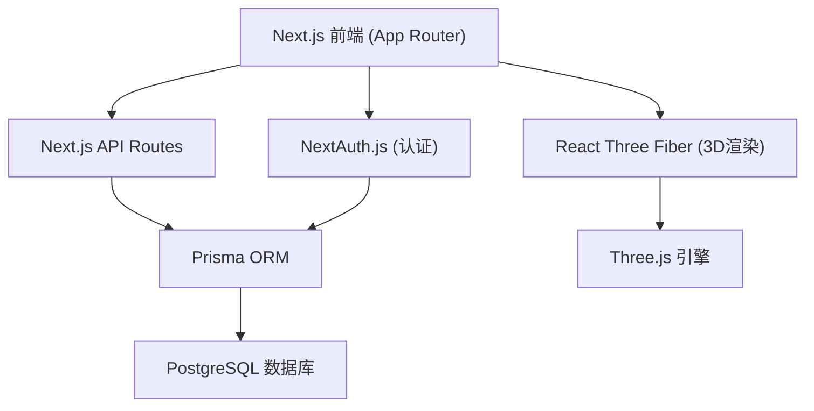
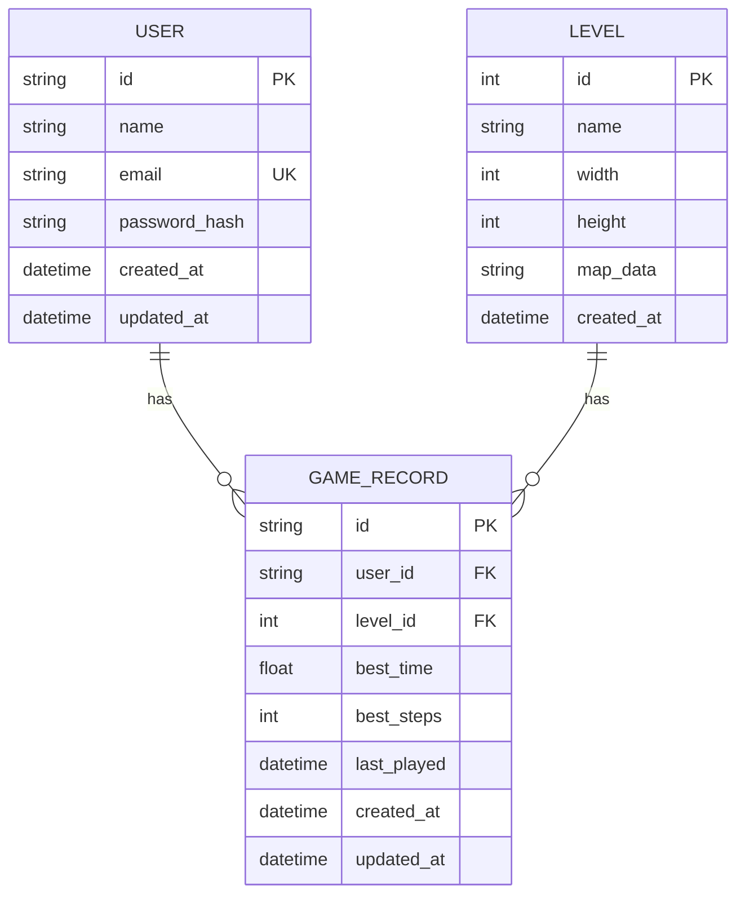

## 1. 架构设计



## 2. 技术说明

- **前端框架**: Next.js 14 (App Router) + React 18 + TypeScript
- **3D引擎**: three.js + @react-three/fiber + @react-three/drei + @react-three/postprocessing
- **样式方案**: Tailwind CSS 3 + CSS Modules
- **认证方案**: NextAuth.js v4 (Credentials 邮箱/密码)
- **数据库**: PostgreSQL 15
- **ORM**: Prisma 5
- **密码加密**: bcryptjs
- **表单验证**: zod + react-hook-form
- **状态管理**: React Context + useReducer (游戏状态)
- **初始化工具**: create-next-app

## 3. 路由定义

| 路由 | 用途 |
|------|------|
| `/` | 登录页（未登录）或关卡选择页（已登录） |
| `/login` | 登录页 |
| `/register` | 注册页 |
| `/levels` | 关卡选择页 |
| `/game/[levelId]` | 3D游戏页 |
| `/result/[levelId]` | 结算页 |
| `/profile` | 个人中心/历史记录页 |
| `/api/auth/[...nextauth]` | NextAuth 认证回调 |
| `/api/register` | 用户注册接口 |
| `/api/levels` | 获取关卡列表接口 |
| `/api/record` | 保存通关记录接口 |
| `/api/records` | 获取历史记录接口 |

## 4. API 定义

### 4.1 注册接口
```typescript
// POST /api/register
// Request:
{
  name: string;      // 用户名
  email: string;     // 邮箱
  password: string;  // 密码（已加密传输）
}
// Response:
{
  success: boolean;
  user?: { id: string; name: string; email: string };
  error?: string;
}
```

### 4.2 关卡列表接口
```typescript
// GET /api/levels
// Response:
{
  levels: {
    id: number;
    name: string;
    width: number;
    height: number;
    bestTime: number | null;  // 当前用户最佳时间（秒）
  }[];
}
```

### 4.3 保存记录接口
```typescript
// POST /api/record
// Request:
{
  levelId: number;
  time: number;    // 用时（秒）
  steps: number;   // 步数
}
// Response:
{
  success: boolean;
  isNewRecord: boolean;  // 是否打破纪录
  bestTime: number;      // 最新最佳时间
}
```

### 4.4 历史记录接口
```typescript
// GET /api/records
// Response:
{
  records: {
    levelId: number;
    levelName: string;
    bestTime: number;
    lastPlayed: string;  // ISO日期字符串
  }[];
}
```

## 5. 数据模型

### 5.1 数据模型定义



### 5.2 数据定义语言

```sql
-- Users Table
CREATE TABLE users (
    id TEXT PRIMARY KEY,
    name TEXT NOT NULL,
    email TEXT UNIQUE NOT NULL,
    password_hash TEXT NOT NULL,
    created_at TIMESTAMP WITH TIME ZONE DEFAULT NOW(),
    updated_at TIMESTAMP WITH TIME ZONE DEFAULT NOW()
);

CREATE INDEX idx_users_email ON users(email);

-- Levels Table
CREATE TABLE levels (
    id SERIAL PRIMARY KEY,
    name TEXT NOT NULL,
    width INTEGER NOT NULL,
    height INTEGER NOT NULL,
    map_data TEXT NOT NULL,
    created_at TIMESTAMP WITH TIME ZONE DEFAULT NOW()
);

-- Game Records Table
CREATE TABLE game_records (
    id TEXT PRIMARY KEY,
    user_id TEXT NOT NULL REFERENCES users(id) ON DELETE CASCADE,
    level_id INTEGER NOT NULL REFERENCES levels(id) ON DELETE CASCADE,
    best_time DOUBLE PRECISION,
    best_steps INTEGER,
    last_played TIMESTAMP WITH TIME ZONE DEFAULT NOW(),
    created_at TIMESTAMP WITH TIME ZONE DEFAULT NOW(),
    updated_at TIMESTAMP WITH TIME ZONE DEFAULT NOW(),
    UNIQUE(user_id, level_id)
);

CREATE INDEX idx_records_user ON game_records(user_id);
CREATE INDEX idx_records_level ON game_records(level_id);

-- Initial Level Data
INSERT INTO levels (name, width, height, map_data) VALUES
('初级训练', 5, 5, '{"grid":[["#","#","#","#","#"],["#",".",".",".","#"],["#",".","P",".","#"],["#",".","$",".","#"],["#","#",".","#","#"]],"targets":[[3,3]]}'),
('小试牛刀', 6, 6, '{"grid":[["#","#","#","#","#","#"],["#",".",".",".",".","#"],["#",".","P",".",".","#"],["#",".","$","$",".","#"],["#",".",".",".",".","#"],["#","#","#","#","#","#"]],"targets":[[2,4],[3,4]]}'),
('经典关卡', 7, 7, '{"grid":[["#","#","#","#","#","#","#"],["#",".",".",".",".",".","#"],["#",".",".","P",".",".","#"],["#",".","$",".","$",".","#"],["#",".",".",".",".",".","#"],["#",".",".",".",".",".","#"],["#","#","#","#","#","#","#"]],"targets":[[2,5],[4,5]]}');
```

## 6. 关卡数据格式说明

```typescript
interface LevelMap {
  grid: string[][];  // 二维字符数组
  // "." = 空地
  // "#" = 墙壁/障碍物
  // "P" = 玩家起点
  // "$" = 箱子
  // "*" = 箱子在目标上
  // "+" = 玩家在目标上
  targets: [number, number][];  // 目标位置 [x, y]
}
```

## 7. 项目目录结构

```
solo-coder/
├── .trae/
│   └── documents/
│       ├── PRD.md
│       └── tech-docs.md
├── prisma/
│   └── schema.prisma
├── src/
│   ├── app/
│   │   ├── layout.tsx
│   │   ├── page.tsx              # 登录/注册入口
│   │   ├── login/page.tsx
│   │   ├── register/page.tsx
│   │   ├── levels/page.tsx
│   │   ├── game/
│   │   │   └── [levelId]/page.tsx
│   │   ├── result/
│   │   │   └── [levelId]/page.tsx
│   │   ├── profile/page.tsx
│   │   └── api/
│   │       ├── auth/[...nextauth]/route.ts
│   │       ├── register/route.ts
│   │       ├── levels/route.ts
│   │       ├── record/route.ts
│   │       └── records/route.ts
│   ├── components/
│   │   ├── auth/
│   │   │   ├── LoginForm.tsx
│   │   │   └── RegisterForm.tsx
│   │   ├── game/
│   │   │   ├── GameCanvas.tsx
│   │   │   ├── Board.tsx
│   │   │   ├── Box.tsx
│   │   │   ├── Player.tsx
│   │   │   ├── Wall.tsx
│   │   │   ├── Target.tsx
│   │   │   └── Controls.tsx
│   │   ├── ui/
│   │   │   ├── Button.tsx
│   │   │   ├── Input.tsx
│   │   │   └── Card.tsx
│   │   └── levels/
│   │       └── LevelCard.tsx
│   ├── lib/
│   │   ├── prisma.ts
│   │   ├── game/
│   │   │   ├── types.ts
│   │   │   ├── levels.ts
│   │   │   └── engine.ts
│   │   └── auth.ts
│   ├── hooks/
│   │   └── useGame.ts
│   └── context/
│       └── GameContext.tsx
├── .env.local
├── next.config.js
├── tailwind.config.js
├── tsconfig.json
└── package.json
```

## 8. 游戏引擎设计

### 8.1 游戏状态

```typescript
interface GameState {
  levelId: number;
  grid: string[][];
  player: { x: number; y: number; dir: Direction };
  boxes: { x: number; y: number }[];
  targets: [number, number][];
  steps: number;
  startTime: number;
  elapsedTime: number;
  isComplete: boolean;
}

type Direction = 'up' | 'down' | 'left' | 'right';
```

### 8.2 核心逻辑

- 玩家移动：按方向键移动一格
- 碰撞检测：玩家不可穿墙
- 推箱子逻辑：玩家前方是箱子且箱子前方是空地时可推动
- 胜利判定：所有箱子都在目标位置上
- 计时：从进入关卡开始计时，通关时停止
