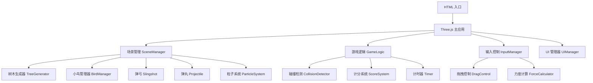

## 1. 架构设计



## 2. 技术描述

- **前端技术栈**：Three.js + Vite + vanilla JavaScript
- **包管理器**：pnpm
- **构建工具**：Vite
- **3D 渲染**：Three.js r160+
- **样式**：原生 CSS + CSS 变量

## 3. 项目结构

```
project-root/
├── index.html
├── package.json
├── src/
│   ├── main.js
│   ├── style.css
│   ├── game/
│   │   ├── Game.js
│   │   ├── SceneManager.js
│   │   ├── InputManager.js
│   │   ├── UIManager.js
│   │   └── constants.js
│   ├── objects/
│   │   ├── Tree.js
│   │   ├── Bird.js
│   │   ├── Slingshot.js
│   │   └── Projectile.js
│   └── utils/
│       ├── ParticleSystem.js
│       ├── CollisionDetector.js
│       └── TrajectoryPredictor.js
└── public/
```

## 4. 核心类定义

### 4.1 Game 主类

| 方法 | 说明 |
|------|------|
| `init()` | 初始化游戏 |
| `start()` | 开始游戏 |
| `update()` | 游戏主循环更新 |
| `restart()` | 重新开始游戏 |
| `gameOver()` | 游戏结束处理 |

### 4.2 SceneManager 场景管理

| 方法 | 说明 |
|------|------|
| `initScene()` | 初始化场景、相机、渲染器 |
| `addLights()` | 添加光照系统 |
| `createGround()` | 创建地面 |
| `createSky()` | 创建天空背景 |

### 4.3 Slingshot 弹弓类

| 方法 | 说明 |
|------|------|
| `createMesh()` | 创建弹弓模型 |
| `updateRubberBand(endPos)` | 更新橡皮筋位置 |
| `resetRubberBand()` | 重置橡皮筋 |

### 4.4 Bird 小鸟类

| 方法 | 说明 |
|------|------|
| `createMesh(color)` | 创建小鸟模型 |
| `update(delta)` | 更新小鸟动画 |
| `respawn(position)` | 重生到新位置 |
| `hit()` | 被击中处理 |

### 4.5 Projectile 弹丸类

| 方法 | 说明 |
|------|------|
| `launch(velocity)` | 发射弹丸 |
| `update(delta)` | 更新物理运动 |
| `reset()` | 重置弹丸 |

### 4.6 CollisionDetector 碰撞检测

| 方法 | 说明 |
|------|------|
| `checkCollision(projectile, birds)` | 检测弹丸与鸟的碰撞 |
| `getBoundingBox(object)` | 获取对象包围盒 |

## 5. 物理参数

| 参数 | 值 | 说明 |
|------|-----|------|
| 重力加速度 | -9.8 m/s² | 模拟真实重力 |
| 最大拖拽距离 | 3.0 单位 | 限制最大拉力 |
| 力度系数 | 8.0 | 拖拽距离到速度的转换系数 |
| 弹丸半径 | 0.15 单位 | 弹丸大小 |
| 小鸟包围盒 | 0.5 x 0.5 x 0.5 | 碰撞检测范围 |

## 6. 性能优化

- 使用对象池管理弹丸和粒子
- 小鸟使用合并几何体减少 draw call
- 碰撞检测使用空间分区优化
- 限制同时存在的粒子数量
