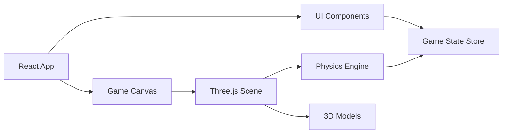

## 1. 架构设计


## 2. 技术描述
- **前端**：React@18 + TypeScript + Vite
- **3D引擎**：Three.js + @react-three/fiber + @react-three/drei
- **状态管理**：zustand
- **样式**：tailwindcss@3
- **物理**：cannon-es + @react-three/cannon (可选，或自定义物理)

## 3. 路由定义
| 路由 | 用途 |
|------|------|
| / | 游戏主页面 |

## 4. 技术栈详情

### 4.1 核心依赖
- three: ^0.160.0 - 3D渲染引擎
- @react-three/fiber: ^8.15.0 - React Three.js渲染器
- @react-three/drei: ^9.88.0 - 常用Three.js组件
- @react-three/cannon: ^6.6.0 - 物理引擎
- zustand: ^4.4.0 - 状态管理
- tailwindcss: ^3.3.0 - CSS框架

### 4.2 项目结构
```
src/
├── components/
│   ├── Game/
│   │   ├── IceRink.tsx       # 冰道组件
│   │   ├── CurlingStone.tsx  # 冰壶组件
│   │   ├── TargetHouse.tsx   # 圆垒组件
│   │   └── GameScene.tsx     # 游戏主场景
│   ├── UI/
│   │   ├── ScorePanel.tsx    # 分数面板
│   │   ├── PowerIndicator.tsx # 力度指示器
│   │   ├── PreviewWindow.tsx # 预览窗口
│   │   └── GameOverModal.tsx # 游戏结束面板
│   └── Controls/
│       └── DragControl.tsx   # 拖动控制器
├── hooks/
│   ├── useGameLogic.ts       # 游戏逻辑hook
│   ├── usePhysics.ts         # 物理计算hook
│   └── useCameraFollow.ts    # 相机跟随hook
├── store/
│   └── useGameStore.ts       # 游戏状态store
├── types/
│   └── game.ts               # 类型定义
├── utils/
│   └── physics.ts            # 物理计算工具
├── App.tsx
└── main.tsx
```

## 5. 数据模型

### 5.1 游戏状态
```typescript
interface GameState {
  currentPlayer: 1 | 2;
  currentRound: number;
  totalRounds: number;
  scores: { player1: number; player2: number };
  stones: Stone[];
  gamePhase: 'ready' | 'aiming' | 'thrown' | 'roundEnd' | 'gameEnd';
}

interface Stone {
  id: string;
  player: 1 | 2;
  position: { x: number; z: number };
  velocity: { x: number; z: number };
  isMoving: boolean;
}

interface ThrowParams {
  power: number;      // 0-100
  direction: number;  // 角度
}
```

## 6. 核心算法

### 6.1 物理模拟
- 摩擦力衰减：velocity *= friction 每帧
- 碰撞检测：冰壶之间、冰壶与边界
- 停止判定：速度低于阈值时停止

### 6.2 计分算法
- 计算每个冰壶到圆心的距离
- 只有距离小于圆垒半径(1.83米)的冰壶计分
- 比较双方最近的冰壶，近的一方得分
- 每颗比对方最近更近的冰壶得1分
