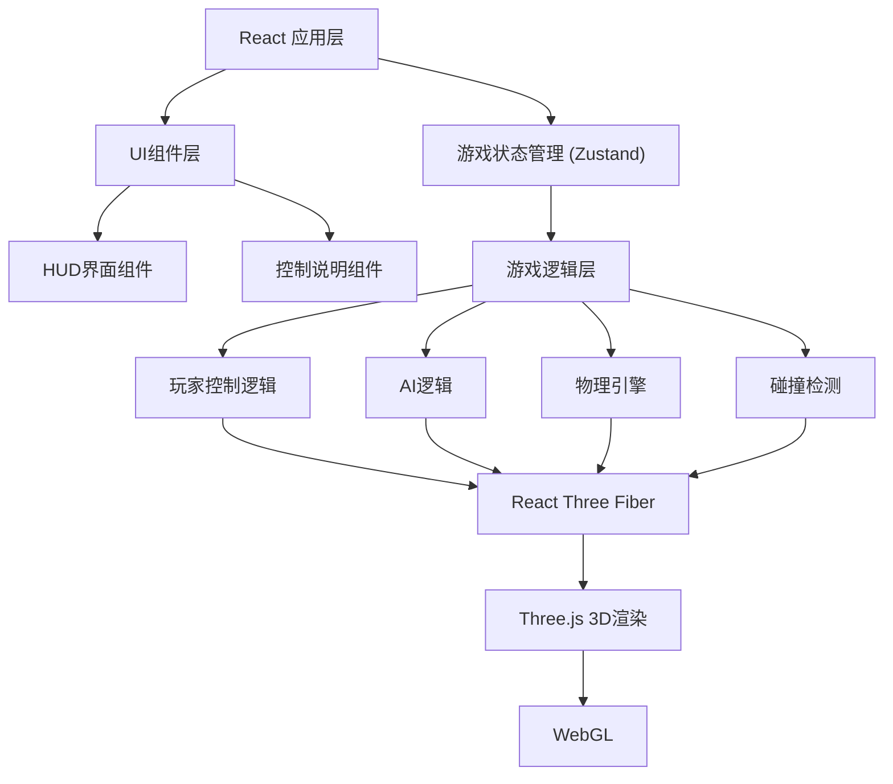

## 1. 架构设计



## 2. 技术说明

- 前端：React@18 + TypeScript + Vite
- 3D渲染：three, @react-three/fiber, @react-three/drei, @react-three/postprocessing
- 状态管理：Zustand
- 样式：TailwindCSS 3
- 物理引擎：自定义简化物理系统（基于向量运算）

## 3. 路由定义

| 路由 | 用途 |
|------|------|
| / | 游戏主界面，包含3D场景和HUD |

## 4. 核心数据模型

### 4.1 游戏状态
```typescript
interface GameState {
  score: { home: number; away: number };
  time: number;
  isPlaying: boolean;
  isPaused: boolean;
  ballPosition: Vector3;
  ballVelocity: Vector3;
  players: Player[];
  controlledPlayerId: string;
}
```

### 4.2 球员
```typescript
interface Player {
  id: string;
  team: 'home' | 'away';
  role: 'forward' | 'midfielder' | 'goalkeeper';
  position: Vector3;
  velocity: Vector3;
  isControlled: boolean;
  hasBall: boolean;
  state: 'idle' | 'running' | 'kicking' | 'tackling';
}
```

## 5. 项目结构

```
src/
├── components/
│   ├── Game.tsx              # 游戏主组件
│   ├── Field.tsx             # 足球场组件
│   ├── Player.tsx            # 球员组件
│   ├── Ball.tsx              # 足球组件
│   ├── Goal.tsx              # 球门组件
│   ├── HUD.tsx               # 界面显示组件
│   └── Controls.tsx          # 控制说明组件
├── hooks/
│   ├── useKeyboard.ts        # 键盘输入钩子
│   └── useGameLoop.ts        # 游戏循环钩子
├── store/
│   └── gameStore.ts          # Zustand状态管理
├── utils/
│   ├── physics.ts            # 物理引擎
│   ├── ai.ts                 # AI逻辑
│   ├── collision.ts          # 碰撞检测
│   └── constants.ts          # 常量定义
├── types/
│   └── index.ts              # TypeScript类型定义
├── App.tsx
├── main.tsx
└── index.css
```
