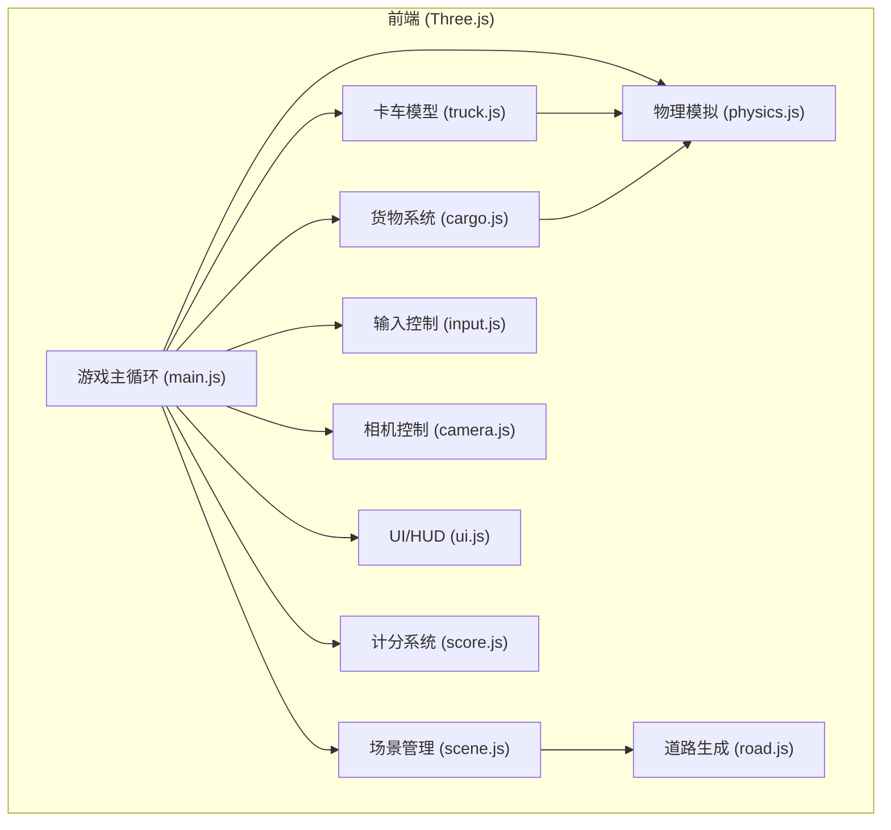

## 1. 架构设计



## 2. 技术说明

- **前端框架**：原生HTML + CSS + JavaScript (ES6 Modules)
- **3D引擎**：Three.js (CDN引入)
- **构建工具**：无构建工具，直接使用ES6模块
- **样式**：原生CSS
- **后端**：无后端，纯前端游戏

## 3. 文件结构

```
solo-coder/
├── index.html              # 游戏入口HTML
├── css/
│   └── style.css           # 游戏样式
├── js/
│   ├── main.js             # 主入口，游戏主循环
│   ├── scene.js            # 场景管理（初始化Three.js、灯光、环境）
│   ├── road.js             # 道路生成（凹凸不平、弯道、上下坡）
│   ├── truck.js            # 卡车模型创建与管理
│   ├── cargo.js            # 货物系统（箱子创建、堆叠、掉落检测）
│   ├── physics.js          # 物理模拟（悬挂、晃动、约束）
│   ├── input.js            # 键盘输入处理
│   ├── camera.js           # 第三人称跟随相机
│   ├── score.js            # 计分与计时系统
│   └── ui.js               # UI/HUD渲染
└── .trae/
    └── documents/
        ├── PRD.md
        └── technical-architecture.md
```

## 4. 模块职责

### 4.1 main.js - 主入口
- 初始化所有模块
- 游戏主循环（requestAnimationFrame）
- 协调各模块更新顺序

### 4.2 scene.js - 场景管理
- 创建Three.js场景、渲染器、相机
- 设置灯光（方向光、环境光）
- 创建天空、地面、环境装饰

### 4.3 road.js - 道路生成
- 生成蜿蜒的乡村道路
- 实现路面高度变化（凹凸、上下坡）
- 创建道路两侧的树木和装饰

### 4.4 truck.js - 卡车模型
- 创建卡车车身（驾驶室+底盘）
- 创建货厢
- 创建车轮（带动画）
- 管理卡车位置和旋转

### 4.5 cargo.js - 货物系统
- 创建箱子（多个）
- 堆叠在货厢上
- 检测箱子掉落
- 管理箱子状态（在货厢/已掉落）

### 4.6 physics.js - 物理模拟
- 卡车悬挂模拟（颠簸响应）
- 货物晃动计算（离心力、冲击力）
- 约束关系（货厢与箱子）
- 掉落判断逻辑

### 4.7 input.js - 输入控制
- 监听WASD按键
- 处理加速、减速、转向
- 输入状态管理

### 4.8 camera.js - 相机控制
- 第三人称跟随
- 平滑跟随过渡
- 根据速度调整视角

### 4.9 score.js - 计分系统
- 计时器
- 掉落扣分（-10/个）
- 送达加分（+50）
- 时间奖励计算
- 最终得分计算

### 4.10 ui.js - UI/HUD
- 显示计时器
- 显示得分
- 显示速度表
- 显示操作提示
- 游戏结束界面

## 5. 核心数据结构

### 卡车状态
```javascript
{
  position: Vector3,
  rotation: Euler,
  velocity: Vector3,
  speed: number,
  steering: number,
  suspensionOffset: number
}
```

### 箱子状态
```javascript
{
  mesh: Mesh,
  position: Vector3,
  rotation: Euler,
  velocity: Vector3,
  angularVelocity: Vector3,
  isOnTruck: boolean,
  hasFallen: boolean
}
```

### 游戏状态
```javascript
{
  isRunning: boolean,
  isFinished: boolean,
  startTime: number,
  elapsedTime: number,
  score: number,
  droppedCount: number,
  deliveredCount: number
}
```

## 6. 性能优化

- 使用对象池管理箱子
- 限制物理更新频率
- 视锥体剔除
- 减少阴影质量（如有）
- 使用BufferGeometry优化几何体

## 7. 技术约束

- 仅使用Three.js核心库（不使用物理引擎如Cannon.js）
- 自行实现简化物理模拟
- 支持现代浏览器（Chrome、Firefox、Edge）
- ES6模块语法
