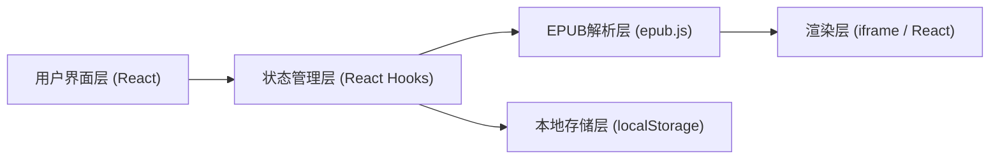

## 1. 架构设计



## 2. 技术说明

- 前端框架：React 18 + TypeScript
- 构建工具：Vite 5
- 样式方案：TailwindCSS 3
- EPUB解析：epub.js
- 状态管理：React Hooks + Context
- 数据存储：localStorage
- 图标：Lucide React

## 3. 目录结构

```
src/
├── components/          # 组件目录
│   ├── Reader/         # 阅读器相关组件
│   │   ├── Reader.tsx
│   │   ├── Toolbar.tsx
│   │   ├── ProgressBar.tsx
│   │   ├── TocPanel.tsx
│   │   ├── BookmarkList.tsx
│   │   └── PageTurn.tsx
│   └── Home/           # 首页组件
│       └── HomePage.tsx
├── hooks/              # 自定义Hooks
│   ├── useEpub.ts
│   ├── useBookmarks.ts
│   ├── useReadingProgress.ts
│   └── useTheme.ts
├── types/              # TypeScript类型定义
│   └── index.ts
├── utils/              # 工具函数
│   └── storage.ts
├── App.tsx
├── main.tsx
└── index.css
```

## 4. 路由定义

| 路由 | 页面 | 说明 |
|------|------|------|
| / | 首页/书架 | 打开书籍入口 |
| /reader | 阅读界面 | 阅读EPUB书籍 |

## 5. 数据模型

### 5.1 书签数据结构

```typescript
interface Bookmark {
  id: string;
  bookId: string;
  cfi: string;
  chapter: string;
  percentage: number;
  createdAt: number;
}
```

### 5.2 阅读进度数据结构

```typescript
interface ReadingProgress {
  bookId: string;
  cfi: string;
  percentage: number;
  lastReadAt: number;
}
```

### 5.3 主题数据结构

```typescript
interface Theme {
  id: 'white' | 'eye' | 'night';
  name: string;
  background: string;
  text: string;
}
```

### 5.4 字体大小配置

```typescript
type FontSize = 'small' | 'medium' | 'large';

const fontSizeMap: Record<FontSize, string> = {
  small: '14px',
  medium: '16px',
  large: '18px',
};
```

## 6. 核心功能实现方案

### 6.1 EPUB解析与渲染
- 使用 epub.js 库解析EPUB文件
- 通过 Book 对象加载书籍
- 使用 rendition 进行分页渲染
- 利用 CFI (Canonical Fragment Identifier) 定位位置

### 6.2 翻页动画
- 使用 CSS transform + transition 实现平滑滑动
- 左右翻页分别对应不同的滑动方向
- 动画时长：300ms，缓动函数：ease-in-out

### 6.3 目录解析
- 从EPUB的navigation / toc中提取目录
- 递归处理多级目录结构
- 支持章节跳转和当前章节高亮

### 6.4 书签系统
- 使用 localStorage 持久化存储
- 以书籍ID为命名空间
- 存储 CFI 位置、章节名、百分比

### 6.5 阅读进度
- 翻页时自动保存当前进度
- 加载书籍时读取并跳转到上次位置
- 显示"已跳转到上次阅读位置"提示

## 7. localStorage存储结构

```
epub_reader_bookmarks: { [bookId]: Bookmark[] }
epub_reader_progress: { [bookId]: ReadingProgress }
epub_reader_theme: ThemeId
epub_reader_font_size: FontSize
```
